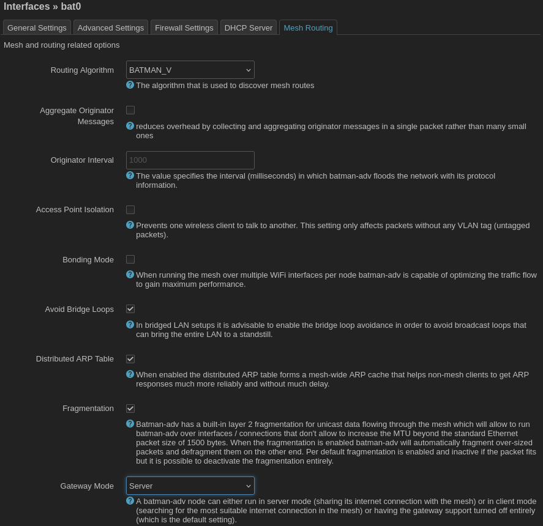

# OpenWRT Batman Mesh Tutorial

This tutorial is based on the YouTube guide by [OneMarcFifty](https://www.onemarcfifty.com/), [DIY MESH WiFi with batman-adv and OpenWrt](https://www.youtube.com/watch?v=t4A0kfg2olo). Also check out [Carlos Gomez's OpenWRT batman mesh guide](https://cgomesu.com/blog/Mesh-networking-openwrt-batman/), which shows how to set everything up on the command line. This tutorial assumes familiarity with OpenWRT, installing/flashing OpenWRT, home wireless networks, and the [OSI Model](https://osi-model.com/) is assumed. The tutorial will demonstrate the simplest way to set up an 802.11s mesh network using the [batman routing protocol](https://www.open-mesh.org/projects/batman-adv/wiki) and OpenWRT's LuCI web interface. Unlike [OneMarcFifty](https://www.onemarcfifty.com/)'s tutorial, we will not delve into VLAN's.

It will be helpful to review some background on wireless mesh and the role of the batman routine protocol. Optimum home network speeds will be achieved when each wireless access point is connected to the main router using an ethernet or fiber optic backhaul. In this scenario, the satellite access points should be configured as ["dumb" access points](https://openwrt.org/docs/guide-user/network/wifi/dumbap), and all access points should enable [802.11r fast transitions](https://openwrt.org/docs/guide-user/network/wifi/basic#fast_bss_transition_options_80211r). The batman routing protocol is not necessary for such a setup.

Batman is useful in scenarios where a wireless backhaul will be used (i.e. because ethernet backhaul would be expensive to install). In a simple network with one wireless router (gateway) and one satellite/repeater access point (client), [WDS](https://openwrt.org/docs/guide-user/network/wifi/atheroswds) is sufficient and will be more performant than batman. In networks with two or more satellite access points, an 802.11s mesh network using the [batman routing protocol](https://www.open-mesh.org/projects/batman-adv/wiki) will be suitable for the vast majority of configurations. The 802.11s mesh provides the OSI Layer 1 link between access points. By default, the Linux kernel uses the [OLSR routing protocol](https://www.open-mesh.org/projects/open-mesh/wiki/The-olsr-story) to route packets/frames over OSI Layer 2 from connected devices (e.g. laptops, cell phones) through the access points to the Internet-connected router (gateway node). The [batman routing protocol](https://www.open-mesh.org/projects/batman-adv/wiki) is an alternative to OLSR that is particularly well-suited to wirelessly-connected nodes because it adapts to actual thouroughput, which may be less than advertised/predicted thoroughput due to wireless range and interference. The batman routing protocol also supports advanced features like hybrid wired/wireless meshes, VLAN's, and multi-WAN/multi-gateway configurations.

## Required Software

OpenWRT does not support wireless mesh or batman mesh routing by default. Creating a custom firmware image is recommended and quite easy using OpenWRT's website. As an alternative, if you have already flashed your router and don't wish to flash a new firmware image, you can install the necessary software packages using the web interface.

Required packages:

- `kmod-batman-adv` kernel support for batman
- `luci-proto-batman-adv` web interface support for batman
- `wpad-mesh-wolfssl` or `wpad-mesh-openssl` (instead of `wpad-basic-mbedtls`) web interface support for 802.11s mesh

Optional packages:

- `luci-app-opkg` to install software from the web interface
- `luci-ssl` (instead of `luci`) to access the web interface over https
- `nano` to edit text files from an ssh terminal

### Using the custom firmware builder

Navigate to the [OpenWRT firmware selector](https://firmware-selector.openwrt.org/). Enter the name of the router you want to build firmware for. In this example we will use the ASUS Lyra (MAP-AC2200), a very capable piece of hardware with two 5 GHz radios. See the [list of triple radio OpenWRT routers](https://forum.openwrt.org/t/tri-band-triple-interface-router-list/177867). Once you select your router, you will see links for the kernel initramfs image (needed for some routers) and default sysupgrade image. At this point, you can go ahead and download the kernel initramfs image (if you need it for your router) since it will not be customized.

Now, click to expand the menu `Customize installed packages and/or first boot script`. 

Here you can edit the list of packages included in the firmware image. As you enter the required packages, you must remove conflicting, similarly-named packages from the list. For example, remove `wpad-mesh-mbedtls` and replace it with `wpad-mesh-wolfssl`. Note: you do not need to enter anything in the `Script to run on first boot` box. When you have finished editing the package list, click the `Request Build` button. You will see a progress bar that looks something like this.

Then entire build process typically takes less than 5 minutes.  When the custom firmware build is finished the progress bar will look like this.

Now you can download the customized sysupgrade image, which includes your custom package selection.

### Installing packages using the LuCI web interface

Navigate to the LuCI web interface in your web browser, typically at [https://192.168.1.1](http://192.168.1.1). 

Locate the menubar at the top of the screen. It should look something like this.

Navigate to `System > Software`. You should see something like this. If you don't see any available software, click on `Update lists...`. Now you can search for and install the required software packages. You will likely need to reboot the router after installing `kmod-batman-adv` for the new kernel module to become available.

## Configuring batman

Flash OpenWRT to your router and perform basic setup tasks (e.g. setting the password) as usual. Then you are ready to set up the 802.11s wireless mesh with the batman routing protocol. First we will set up the gateway router connected to the WAN (Internet). Then the tutorial will go over additional steps needed to set up the client mesh nodes.

### Creating the batman interfaces

Navigate to the LuCI web interface in your web browser, typically at [https://192.168.1.1](http://192.168.1.1). 

Locate the menubar at the top of the screen. It should look something like this.

Navigate to `Network > Interfaces`. You should see something like this.

Click on the `Add new interface...` button.

From the drop-down menu `Protocol` select `Batman Device`. Give the device a name like `bat0`. Then click `Create interface`. This will create a tunnel device called `bat0`. OSI Layer 2 packets/frames sent over the the tunnel will be routed using the batman protocol. Next, we will be prompted to configure some batman-specific options. You can edit these options again later by clicking the `Edit` button next to the `bat0` interface.

You can accept most of the default options. Navigate to the `Mesh Routing` tab to make a few recommended changes.

First, select the `Routing Algorithm` you want. You can use either `BATMAN_IV` or `BATMAN_V`. All mesh nodes must be configured to use the same version of the batman protocol. Next, check the box to `Avoid Bridge Loops`. Finally, I recommend setting `Gateway Mode` to `Server` to explicitly tell batman that this router will be a gateway to the Internet. (Later, when configuring client nodes, we will set `Gateway Mode` to `Client`.)

Save your changes. You are finished setting up the `bat0` device. Next we will create an alias interface for associating a radio with the batman mesh. Click `Add new interface...` again.

Select `Batman Interface` from the dropdown menu. Give the interface a name like `batmesh`. **Important:** do not associate the interface with a device in this menu. You will associate the interface with the `bat0` batman device in the next step. For now, leave `Device` as `unspecified` and click `Create Interface`.

After you create the `batmesh` interface you will be prompted to configure its settings. Here you can set the `Batman Device` to `bat0`. You should not need to change any of the other default options.

## Bridging LAN to the mesh

You will most likely want to bridge the `bat0` tunnel interface with the local area network. This will allow traffic from the ethernet lan ports and wireless access points to be routed over the mesh. If performed on both the gateway node and the client ndoes, this means (1) that the client node routers themselves can get local IP addresses and access the Internet over the mesh and (2) any devices plugged into the client nodes' ethernet LAN ports (e.g. desktop computers) can get a local IP address and access the Internet over the mesh.

 Navigate to `Network > Interaces` and then click on the `Devices` tab.

Note: if the `bat0` device does not appear in the list of devices and you have just created it in the previous step, you may have to click `Save & Apply` for the `bat0` device to actually be created. Once you can see the `bat0` device in the list, click the `Configure...` button next to the `br-lan` bridge device.

Check boxes next to the interfaces you want to be bridged. Due to an idiosyncracy of OpenWRT, you will _not_ see any wireless interfaces here. Don't worry, we will connect them to the LAN in a later step. For now, as in this example, check the `bat0` device in addition to any lan ethernet ports. Then click `Save`.

## Wireless configuration

### Design Considerations

You can add one or more radios to the 802.11s mesh using the batman routing protocol. The most typical configuration is to use the 5 GHz radio as the 802.11s mesh backhaul and set up the 2.4 GHz radio as an access point (AP). In devices such as the Lyra (in this example) with two 5 GHz radios, one 5 GHz radio is used for the mesh backhaul and the other 5 GHz radio can be used as an access point.

Typically you will want to use a 5 GHz radio for the mesh backhaul since the 5 GHz band has more bandwidth than the 2.4 GHz band. However, 2.4 GHz has longer range and may be a better choice if your mesh nodes are far apart.

Some radios support being configured as both access points (AP's) and 802.11s mesh nodes operating on the same frequency at the same time. While this configuration may be technically possible, it leads to interference between the 5 GHz AP and mesh traffic, which can cause unstable convergence of mesh routing.

### Configurating a radio for mesh

Navigate to `Network > Wireless`.

In this example there are three radios, all of which have been configured in AP (access point) mode by default. There are two 5 GHz (802.11ac) radios. The first, `radio0`, is hardware-limited to transmit on the lower half of the 5 GHz band. The other, `radio2`, is hardware-limited to transmit on the upper half of the 5 GHz band. The upper half of the 5 GHz band can be unstable due to [DFS](https://en.wikipedia.org/wiki/Dynamic_frequency_selection), so we will use the more reliable `radio0` for our mesh backhaul. Click `Edit` on the wireless interface just below `radio0` (or click `Remove` on the interface and click `Add` next to `radio0` to make a new interface).

Use the dropdown menu to change the interface's `Mode` to `802.11s`. For the mesh id, chose a name that will be different from the name of the access point. In this example the access point will have the SSID `Constellation`, so for the mesh ID we will use the name `Constellation-mesh`. This ID must be the same on all mesh ndoes. For `Network` chose the `batmesh` interface created in the previous steps. Do _not_ set the wireless channel to auto. The wireless channel must be the same on all mesh nodes. Next go to the `Wireless Security` tab.

Choose a WPA3-SAE key. The key must be the same on all mesh nodes. The key does not have to be the same as the key used for the access point.

Under advanced settings, _un_-check the box for `Forward mesh peer traffic`. The 802.11s mesh forwards mesh peer traffic using the OLSR routing protocol by default. By un-checking this box, you disable OLSR allow peer traffic to be forwarded using the batman routing protocol instead.

Do _not_ configure wireless roaming on the mesh nodes. You _will_ configure wireless roaming on the access points.

### Configuring the access points

Configure the other radios as access points as you usually would. You do _not_ want the access points to be on the same channel because they will interfere with each other. Set the `Channel` to `auto` to make each access point automatically select a different channel from its neighbors.

You will associate the access points with the `lan` network as usual. Since the `lan` network is bridged to `bat0`, traffic to/from the access points can be routed through `bat0`, `batmesh`, and the 802.11s radio.

You _should_ configure 802.11r fast transition on the access points to allow connected devices to more seamlessly transition between different AP's in the mesh. Go to the `WLAN roaming` tab and check the box `802.11r Fast Transition`. All access points with the same SSID should be given the same `Mobility Domain`. You can leave this as OpenWRT's default, `4f57`, or change it to any 4-character hexadecimal ID provided it is the same on all AP's. The `FT protocol` should be left as `FT over the Air`.

## Configuring client nodes

The gateway mesh node connected to the Internet/WAN has been configured. Now you will want to configure several mesh satellite, or client nodes. The client nodes will be bridged to the gateway node on OSI layer 2 via the batman mesh, so the client nodes do not need to perform (and should not perform) any OSI layer 3 functions such as DHCP lease assignment, firewall/packet filtering, or routing. In fact, having the client nodes try to provide this functionality would interfere with proper operation of the mesh network!

Thus, **before** you add your client node to the mesh using the steps above, you will want to configure the client nodes as ["dumb" access points](https://openwrt.org/docs/guide-user/network/wifi/dumbap). You will likely still want to give the client nodes IP addresses on the lan so that you can log into them for maintenance and diagnostics.

### Setting a static IP address

Assigning your client mesh node an IP address is technically optional since an IP address is not needed for layer 2 OSI routing, but it's probably still a good idea so that you have some way to access the LuCI web interface on the mesh node!

Go to `Network > Interfaces` and click `Edit` on the `lan` interface.

Change the IPv4 address to something on the same subnet and netmask as the gateway router. Typically your gateway will have the IP address 192.168.1.1 and give out DHCP leases on some interval between 192.168.1.100 to 192.168.1.254. Pick a static IP address for your client mesh node that doesn't conflict with the gateway router, statically-assigned IPs for other client mesh nodes, or potential leases from the DHCP interval. In this example I have another client mesh node with the IP address 192.168.1.2, so I will assign this client mesh node to be 192.168.1.3. Note: you must leave the gateway address blank here even until after you click `Save`.

After you click `Save`, you can return to the `lan` settings and set the default gateway to point to the IP address of the gateway router, which is typically 192.168.1.1.

Then go to the `Advanced Settings` tab and under `Use custom DNS servers` enter the DNS server you want to use. The gateway node is configured as a DNS server by default, so typically you can just enter the IP address of the gateway router here, 192.168.1.1.

When you eventually click `Save and Apply` you will see a warning like this.

Click `Apply and keep settings`. The auto-refresh feature won't work because the router's IP address has now changed from 192.168.1.1 to whatever new IP address you have assigned it. In this example, the IP address is now 192.168.1.3. You will need to manually enter the new address in your web browser's address bar and log back in to the LuCI web interface to continue.

### Disabling the DHCP server

OpenWRT routers issue DHCP leases on the local are network by default. To avoid conflicts and ensure IPv6 prefix delegation works properly, only one router, the gateway node, to issue DHCP leases. You must disable the DHCP server and related OSI 3 functionality on the client mesh nodes. First go to `Network > Interfaces` and `Edit` the `lan` interface. Click on the `DHCP Server` tab.

Check the `ignore interface` box. Then navigate over to the `IPv6 Settings tab.

Place the `RA-Service` into `relay mode` (or simply turn it off) and set the `DHCPv6-Service` to `disabled`. The `IPv6 RA Settings` tab should now dissapear.  Click `Save`.

Next, return to the `Advanced Settings` tab and un-check `Delegate IPv6 prefixes`. The gateway router will be responsible for IPv6 previx delegation.

Finally, navigate to `System > Startup` and sisable the `dnsmasq`, `firewall`, and `odhcpd` services.

### Connecting client nodes to the mesh

Now it is safe to setup `bat0`, `batmesh`, 802.11s, and access points on your client node using exactly the same steps as you used for the gateway node above. When configuring the `bat0` interface, go to the `Mesh Routing` tab and make sure you set `Gateway Mode` to `Client` or `Off` on the client nodes.

When you are done, devices should be able to connect to the client node wirelessly (via its acces point) or over its ethernet LAN port and access the Internet.

### Using the WAN port as a LAN port

Many routers have a physical WAN port that is normally connected to an Internet modem. You can safely leave this port configured as the WAN port on your client mesh nodes -- just don't plug anything into it. If you want, you can repurpose the port to behave like an extra LAN port by adding it to the `br-lan` bridge device. This is especially handy if you have multiple ethernet-connected devices (e.g. desktop computers) that are going to access the Internet via the mesh node.  If you are going to do this, first navigate to `Network > Interfaces` and click `Delete` next to the `wan` and `wan6` interfaces. Note: these are alias interfaces, not the actual wan port.

Then go to the `Devices` tab.

Click `Configure...` on the `br-lan` device. Click on the `Bridge ports` and check the box to add the `wan` port to the bridge. Note: typically you should _not_ add any switches to the bridge, only the switch ports. Now the WAN port is bridged to the local area network. Any ethernet device can be plugged in to the WAN port or the LAN port, connect via the mesh, receive a local IP address, and access the Internet.

### IPv6 connectivity for the node

The client mesh nodes probably do not need to access the network over IPv6, but you can configure them to have IPv6 connectivity if you want. Note that this will have security implications since the client mesh node may receive a _public_ IPv6 address from the gateway router and thus no longer be protected by the gateway router's NAT firewall. Navigate to `Network > Interfaces` and add a new interface.

Give the interface a name (here, wan6 to emphasize that this interface will have a public IP), set the protocol to `DHCPv6 client`, and set the device to `br-lan`, which will connect the interface to the mesh.

Under the interface's settings, change the `Request IPv6-prefix of length` dropdown menu to `disabled`. The client mesh node should not need an IPv6-prefix for delegation. The gateway node will handle this.

Finally, navigate to the `Advanced Settings` tab and again un-check the box for `Delegate IPv6 prefixes`. The gateway node will handle this.