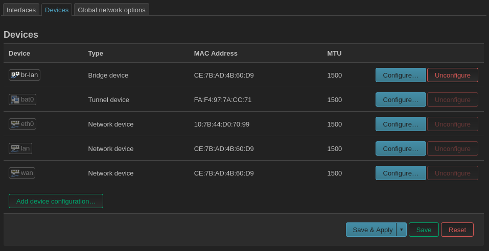
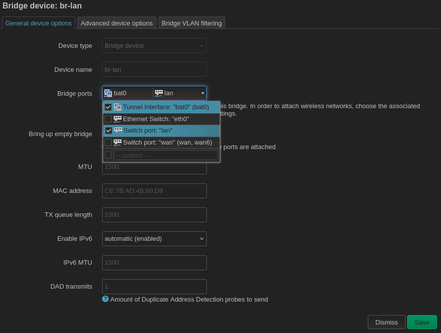

## Bridge LAN to the mesh

You will most likely want to bridge the `bat0` tunnel interface with the local area network. This will allow traffic from the ethernet lan ports and wireless access points to be routed over the mesh. If performed on both the gateway node and the client nodes, this means (1) that the client node routers themselves can get local IP addresses and access the Internet over the mesh and (2) any devices plugged into the client nodes' ethernet LAN ports (e.g. desktop computers) can get a local IP address and access the Internet over the mesh.

Navigate to `Network > Interaces` and then click on the `Devices` tab.

Note: if the `bat0` device does not appear in the list of devices and you have just created it in the previous step, you may have to click `Save & Apply` for the `bat0` device to actually be created. Once you can see the `bat0` device in the list, click the `Configure...` button next to the `br-lan` bridge device.

Check boxes next to the interfaces you want to be bridged. Due to an idiosyncracy of OpenWRT, you will _not_ see any wireless interfaces here. Don't worry, we will connect them to the LAN in a later step. For now, as in this example, check the `bat0` device in addition to any lan ethernet ports. Then click `Save`.
