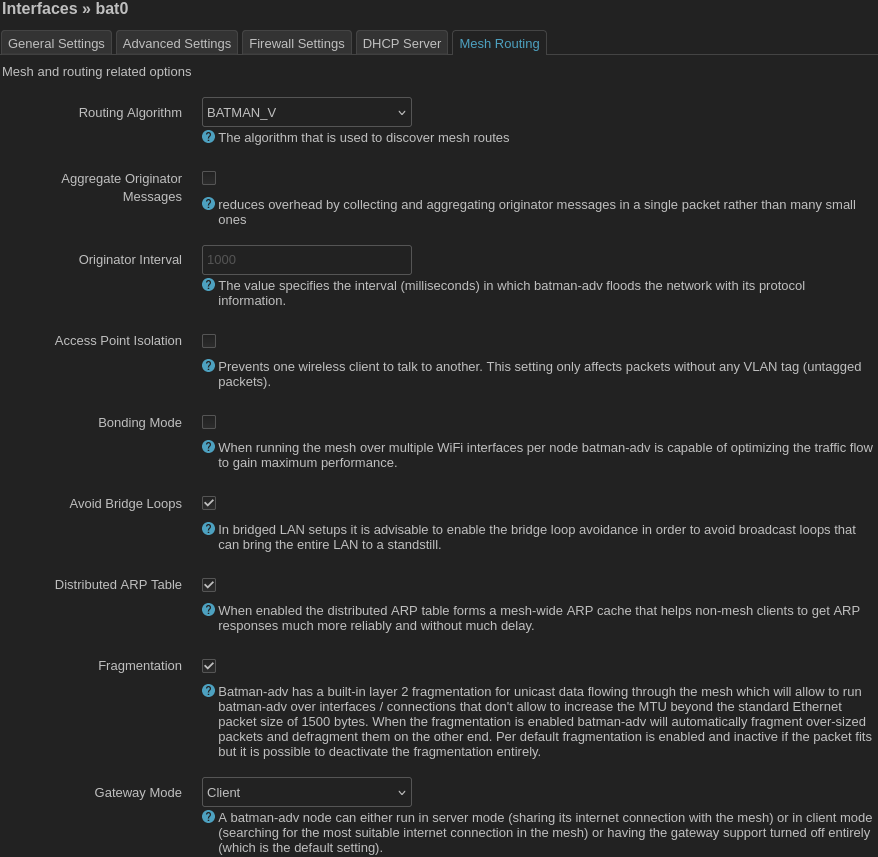

### Connecting client nodes to the mesh

Once you have [configured a static IP](static_ip.md) and [disabled Layer 3 services](layer3.md) it is safe to setup `bat0`, `batmesh`, 802.11s, and access points on your client node using exactly the same steps as you used for the gateway node. When configuring the `bat0` interface, go to the `Mesh Routing` tab and make sure you set `Gateway Mode` to `Client` or `Off` on the client nodes.

When you are done, devices should be able to connect to the client node wirelessly (via its acces point) or over its ethernet LAN port and access the Internet.
