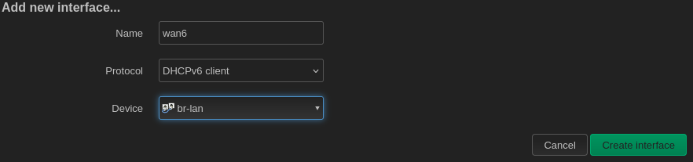
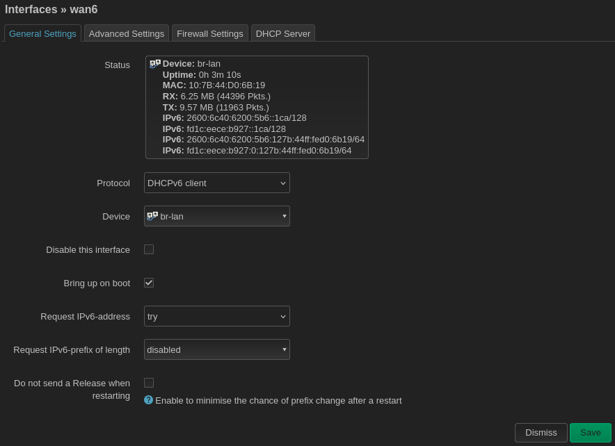
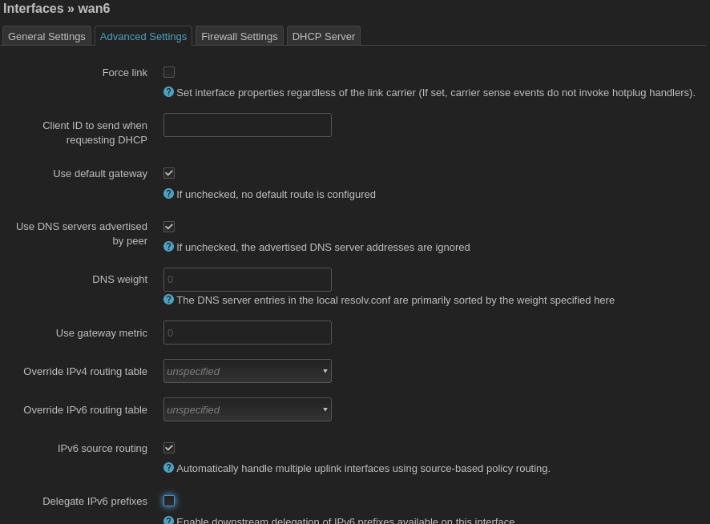

### IPv6 connectivity for the node

The client mesh nodes probably do not need to access the network over IPv6, but you can configure them to have IPv6 connectivity if you want. Note that this will have security implications since the client mesh node may receive a _public_ IPv6 address from the gateway router and thus no longer be protected by the gateway router's NAT firewall. Navigate to `Network > Interfaces` and add a new interface.

Give the interface a name (here, wan6 to emphasize that this interface will have a public IP), set the protocol to `DHCPv6 client`, and set the device to `br-lan`, which will connect the interface to the mesh.

Under the interface's settings, change the `Request IPv6-prefix of length` dropdown menu to `disabled`. The client mesh node should not need an IPv6-prefix for delegation. The gateway node will handle this.

Finally, navigate to the `Advanced Settings` tab and again un-check the box for `Delegate IPv6 prefixes`. The gateway node will handle this.
