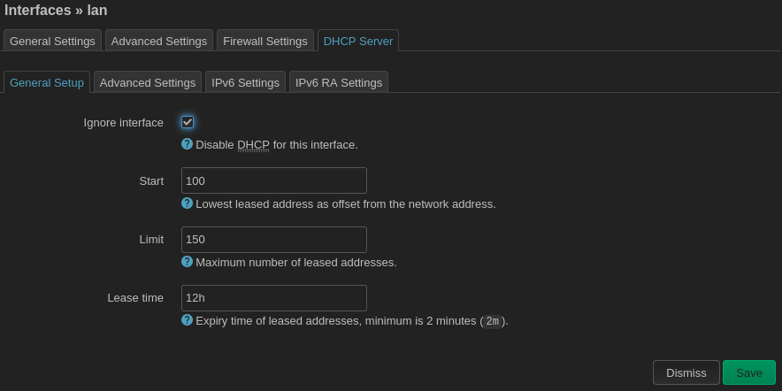
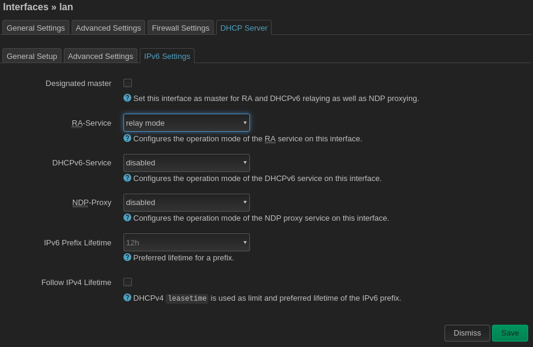
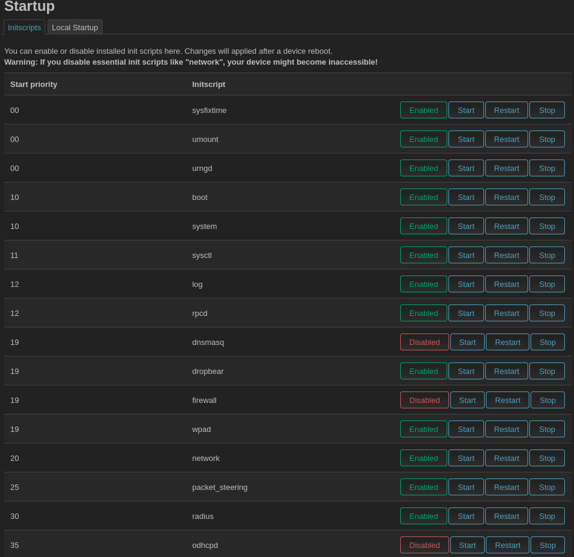

### Disabling Layer 3 Services

OSI Layer 2 is the data link layer and performs the kind of functions that an ethernet switch performs. The Batman mesh works on layer 2. You can think of the Batman mesh as a giant ethernet switch (actually connected by a wireless backhaul) that your computers, cell phones, etc are connected to. Your gateway mesh router was configured in Batman "server" mode and behaves as if it were connected to the upstream port of your imaginary ethernet switch.

OSI Layer 3 is the network layer that handles IP addresses and non-local routing. Your gateway mesh router fulfills layer 3 functions like assigning IP addresses to connected devices.  Each client mesh node function as a ["dumb"](https://openwrt.org/docs/guide-user/network/wifi/dumbap) port on the imaginary ethernet switch that your computer, cell phone, etc can plug in to. You do not want to your client node to _also_ be handing out IP addresses, especially since they might conflict with DHCP leases granted by the gateway node!

You must disable the DHCP server and related OSI 3 functionality on the client mesh nodes. First go to `Network > Interfaces` and `Edit` the `lan` interface. Click on the `DHCP Server` tab.

Check the `ignore interface` box. Then navigate over to the `IPv6 Settings tab.

Place the `RA-Service` into `relay mode` (or simply turn it off) and set the `DHCPv6-Service` to `disabled`. The `IPv6 RA Settings` tab should now dissapear.  Click `Save`.

Next, return to the `Advanced Settings` tab and un-check `Delegate IPv6 prefixes`. The gateway router will be responsible for IPv6 previx delegation.

Finally, navigate to `System > Startup` and sisable the `dnsmasq`, `firewall`, and `odhcpd` services.

* dnsmasq is a DNS and DHCPv4 server
* firewall is the firewall, which also handles network address translation (NAT)
* odhcpd is a DHCPv6 server

