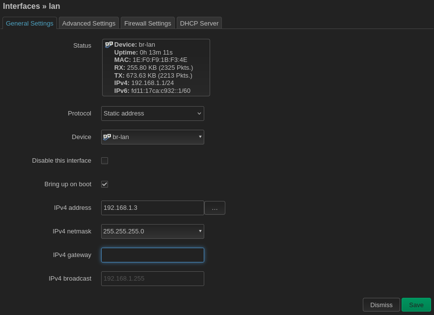
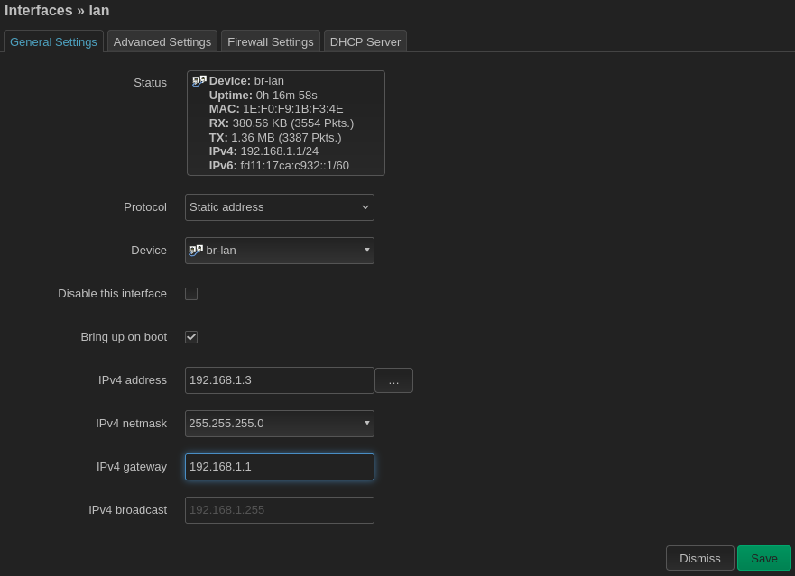
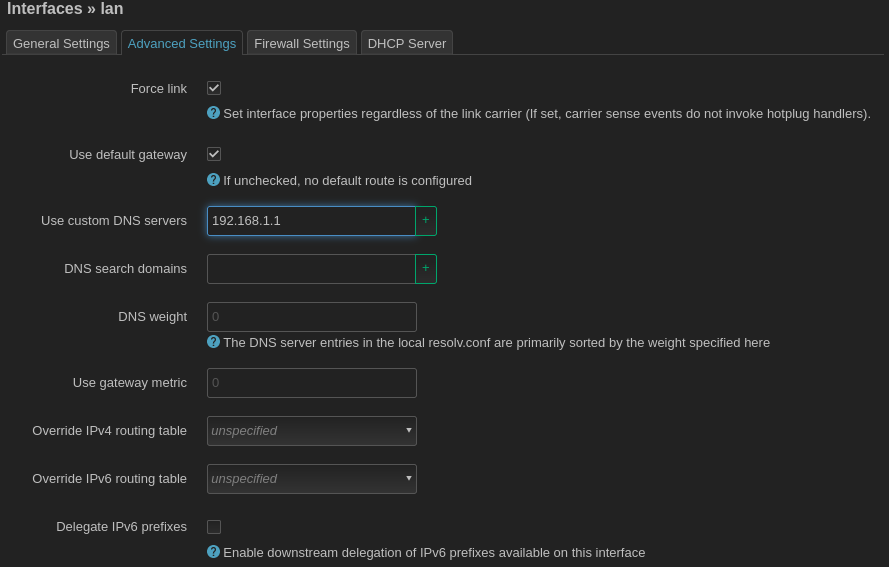
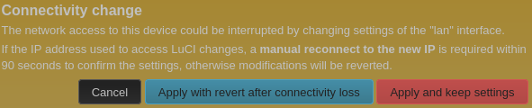

### Setting a static IP address

Assigning your client mesh node an IP address is technically optional since an IP address is not needed for layer 2 OSI routing, but it's probably still a good idea so that you have some way to access the LuCI web interface on the mesh node!

Go to `Network > Interfaces` and click `Edit` on the `lan` interface.

Change the IPv4 address to something on the same subnet and netmask as the gateway router. Typically your gateway will have the IP address 192.168.1.1 and give out DHCP leases on some interval between 192.168.1.100 to 192.168.1.254. Pick a static IP address for your client mesh node that doesn't conflict with the gateway router, statically-assigned IPs for other client mesh nodes, or potential leases from the DHCP interval. In this example I have another client mesh node with the IP address 192.168.1.2, so I will assign this client mesh node to be 192.168.1.3. Note: you must leave the gateway address blank here even until after you click `Save`.

After you click `Save`, you can return to the `lan` settings and set the default gateway to point to the IP address of the gateway router, which is typically 192.168.1.1.

Then go to the `Advanced Settings` tab and under `Use custom DNS servers` enter the DNS server you want to use. The gateway node is configured as a DNS server by default, so typically you can just enter the IP address of the gateway router here, 192.168.1.1.

When you eventually click `Save and Apply` you will see a warning like this.

Click `Apply and keep settings`. The auto-refresh feature won't work because the router's IP address has now changed from 192.168.1.1 to whatever new IP address you have assigned it. In this example, the IP address is now 192.168.1.3. You will need to manually enter the new address in your web browser's address bar and log back in to the LuCI web interface to continue.