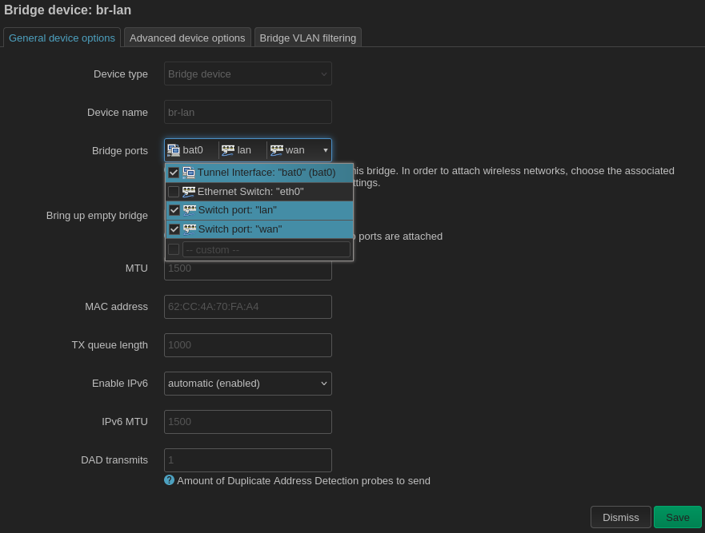

### Using the WAN port as a LAN port

Many routers have a physical WAN port that is normally connected to an Internet modem. You can safely leave this port configured as the WAN port on your client mesh nodes -- just don't plug anything into it. If you want, you can repurpose the port to behave like an extra LAN port by adding it to the `br-lan` bridge device. This is especially handy if you have multiple ethernet-connected devices (e.g. desktop computers) that are going to access the Internet via the mesh node.  If you are going to do this, first navigate to `Network > Interfaces` and click `Delete` next to the `wan` and `wan6` interfaces. Note: these are alias interfaces, not the actual wan port.

Then go to the `Devices` tab.

Click `Configure...` on the `br-lan` device. Click on the `Bridge ports` and check the box to add the `wan` port to the bridge. Note: typically you should _not_ add any switches to the bridge, only the switch ports. Now the WAN port is bridged to the local area network. Any ethernet device can be plugged in to the WAN port or the LAN port, connect via the mesh, receive a local IP address, and access the Internet.

