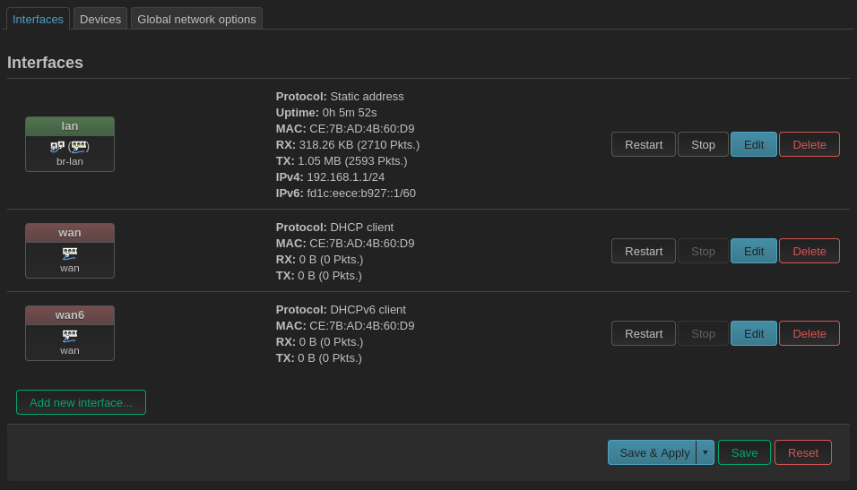
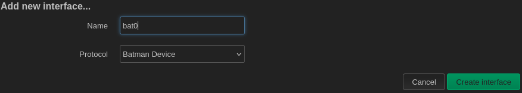
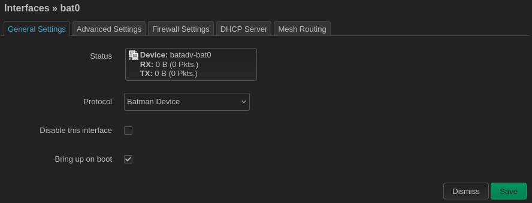
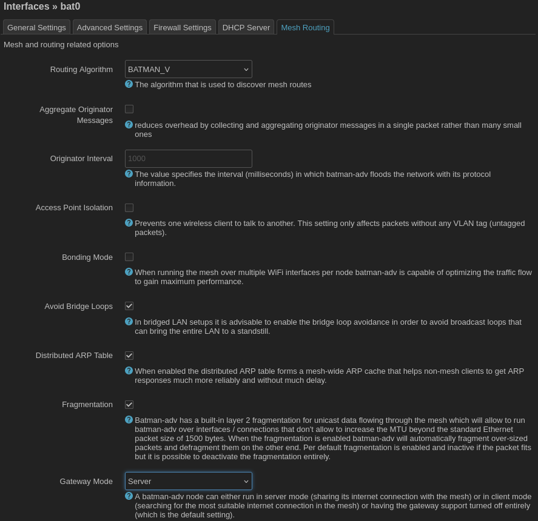
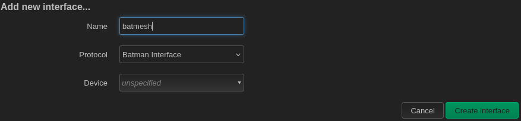
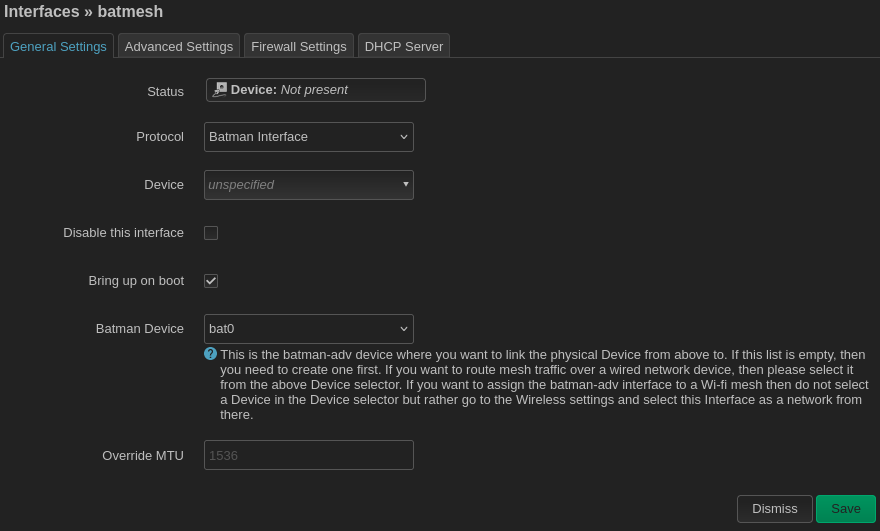

## Configure batman interfaces

Navigate to the LuCI web interface in your web browser, typically at [https://192.168.1.1](http://192.168.1.1). 

Locate the menubar at the top of the screen. It should look something like this.

Navigate to `Network > Interfaces`. You should see something like this.

Click on the `Add new interface...` button.

From the drop-down menu `Protocol` select `Batman Device`. Give the device a name like `bat0`. Then click `Create interface`. This will create a tunnel device called `bat0`. OSI Layer 2 packets/frames sent over the the tunnel will be routed using the batman protocol. Next, we will be prompted to configure some batman-specific options. You can edit these options again later by clicking the `Edit` button next to the `bat0` interface.

You can accept most of the default options. Navigate to the `Mesh Routing` tab to make a few recommended changes.

First, select the `Routing Algorithm` you want. You can use either `BATMAN_IV` or `BATMAN_V`. All mesh nodes must be configured to use the same version of the batman protocol. Next, check the box to `Avoid Bridge Loops`. Finally, I recommend setting `Gateway Mode` to `Server` to explicitly tell batman that this router will be a gateway to the Internet. (Later, when configuring client nodes, we will set `Gateway Mode` to `Client`.)

Save your changes. You are finished setting up the `bat0` device. Next we will create an alias interface for associating a radio with the batman mesh. Click `Add new interface...` again.

Select `Batman Interface` from the dropdown menu. Give the interface a name like `batmesh`. **Important:** Do not associate the interface with a device in this menu. You will associate the interface with the `bat0` batman device in the next step. For now, leave `Device` as `unspecified` and click `Create Interface`.

After you create the `batmesh` interface you will be prompted to configure its settings. Here you can set the `Batman Device` to `bat0`. **It is important to override the MTU.**  MTU standard for maximum transmission unit and is the largest packet that can be transmitted over the interface without fragmentation. The default MTU for wireless devices is 1500 bytes, but [Batman needs additional space to prepend its own header information](https://www.open-mesh.org/projects/batman-adv/wiki/Fragmentation-technical). In the `Override MTU` box you may see a suggested value of `1536`; you must manually type in 1528 (which is large enough per the [Batman documentation](https://www.open-mesh.org/projects/batman-adv/wiki/Fragmentation-technical) or 1536 to actually override the MTU. If you skip this step, your mesh network will still work but it will be very slow!

You should not need to change any of the other default options.
