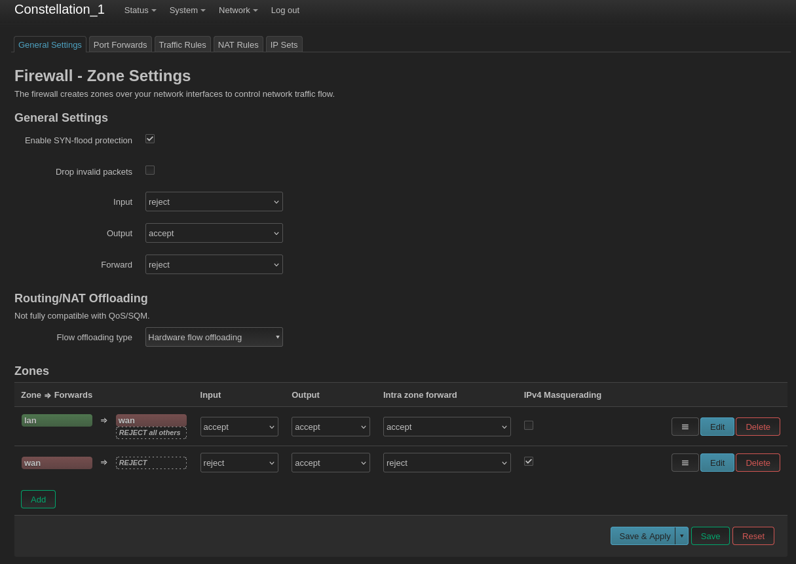
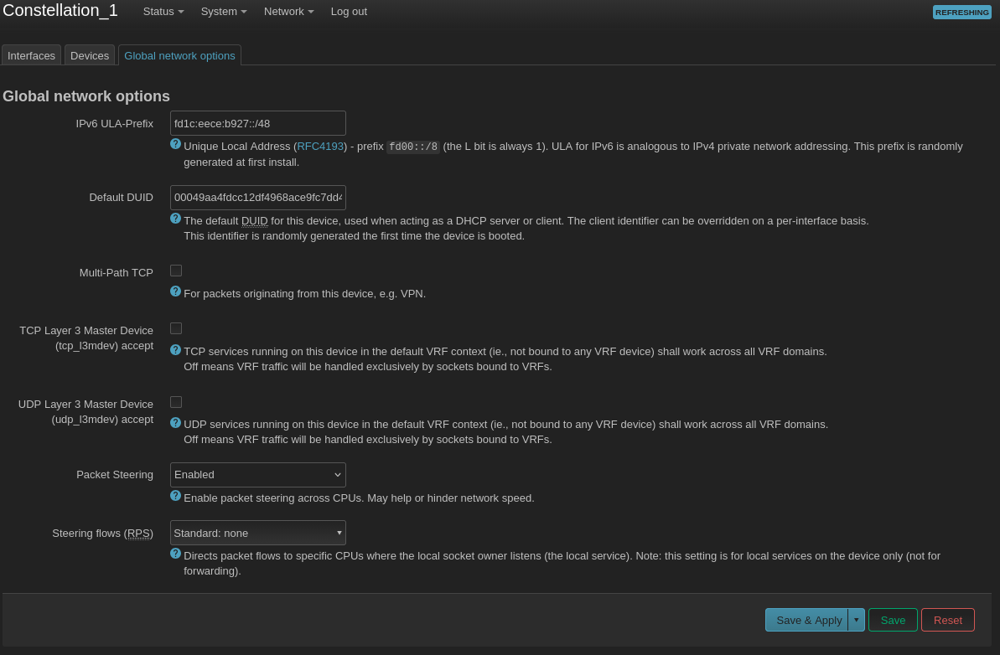

## Speedy Optimizations

Wireless mesh networking is not as fast as Ethernet backhaul, but with good hardware and the right configuration, you can still get good performance. I get at least 300 Mbps symmetric using the ASUS Lyra. Here are some suggested optimizations to get the most performance out of your wireless mesh.

### Override the Default MTU

If you have not already done so, go back to [configuring the batman interfaces](configure_batman_interfaces.md) and override the default MTU on batmesh. Set it to a value of 1528 or 1536. This prevents wireless packet fragmentation over the mesh backhaul and will get you a 10x performance boost if you forgot to configure it in the earlier steps.

### Enable Hardware Offloading

On routers that support it, packets can be "offloaded" from the CPU and be transferred directly between network interfaces without actually going through the CPU.  This will get you a 2x-5x speed boost on devices with underpowered CPUs (like the Asus Lyra) whose stock firmware relies on the offloading feature to achieve advertised network thourouput. There are two places you need to enable hardware offloading in OpenWRT.

Go to `Network` > `Firewall` and under the `General Settings` tab find the `Flow offloading type` drop-down menu and choose `Hardware flow offloading`.

### Enable Packet Steering

Closely related to hardware offloading, packet steering involves trying to direct packets to the CPU core that is going to process them. I have not noticed any particular performance benefit or penalty from enabling it, but if you are curious, go to `Network` > `Interfaces`, look under the `Global network options` tab, find the `Packet Steering` drop-down menu, and choose `Enabled`.

