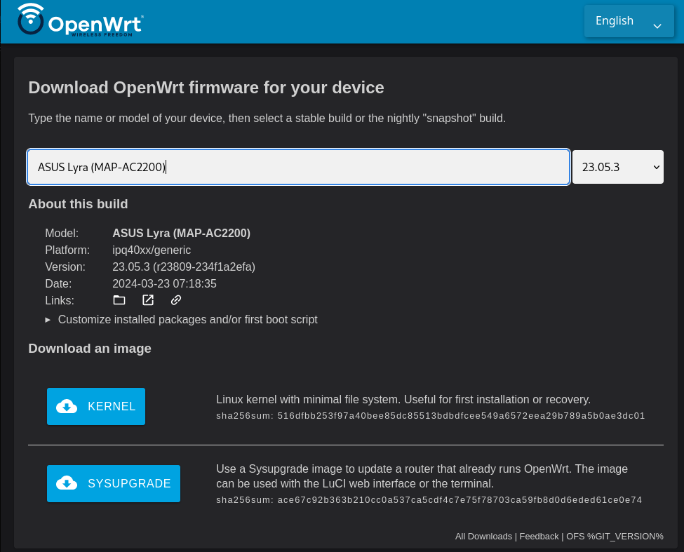
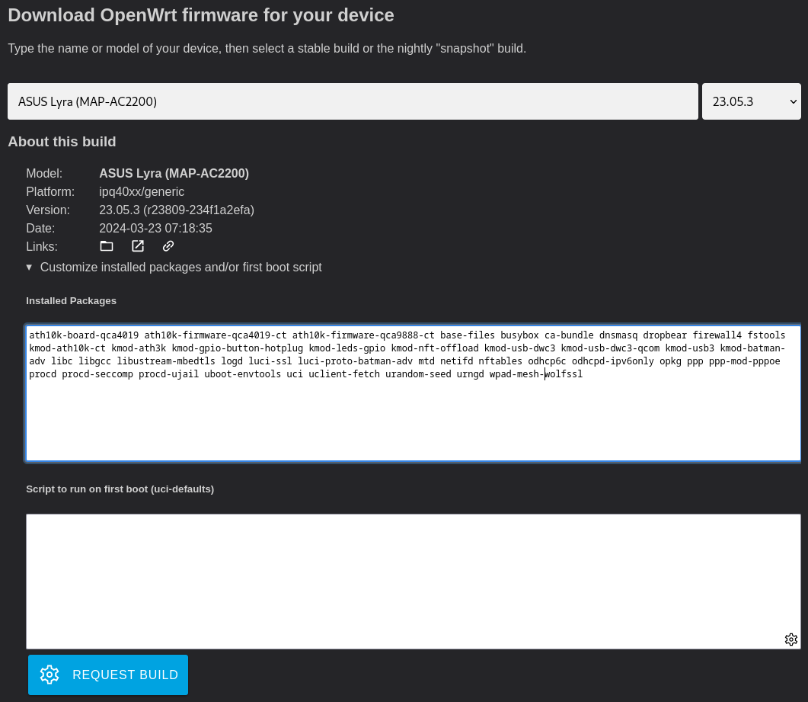
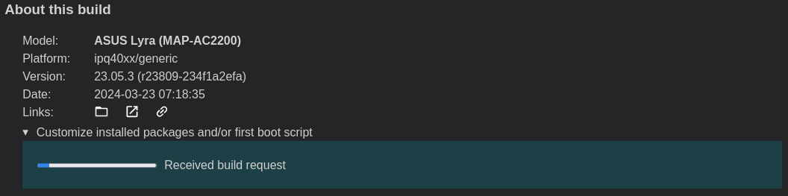
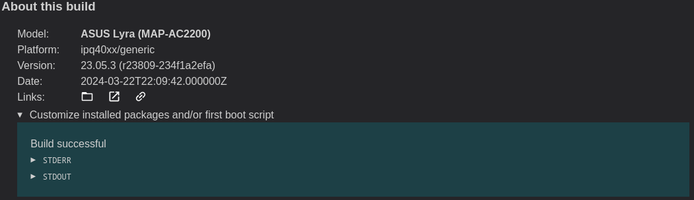

### Using the custom firmware builder

Navigate to the [OpenWRT firmware selector](https://firmware-selector.openwrt.org/). Enter the name of the router you want to build firmware for. In this example we will use the ASUS Lyra (MAP-AC2200), a very capable piece of hardware with two 5 GHz radios. See the [list of triple radio OpenWRT routers](https://forum.openwrt.org/t/tri-band-triple-interface-router-list/177867). Once you select your router, you will see links for the kernel initramfs image (needed for some routers) and default sysupgrade image. At this point, you can go ahead and download the kernel initramfs image (if you need it for your router) since it will not be customized.

Now, click to expand the menu `Customize installed packages and/or first boot script`. 

Here you can edit the list of packages included in the firmware image. As you enter the required packages, you must remove conflicting, similarly-named packages from the list. For example, remove `wpad-mesh-mbedtls` and replace it with `wpad-mesh-wolfssl`. Note: you do not need to enter anything in the `Script to run on first boot` box. When you have finished editing the package list, click the `Request Build` button. You will see a progress bar that looks something like this.

Then entire build process typically takes less than 5 minutes.  When the custom firmware build is finished the progress bar will look like this.

Now you can download the customized sysupgrade image, which includes your custom package selection.

