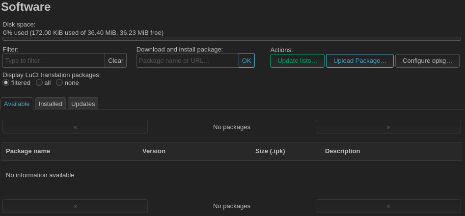

### Installing packages using the LuCI web interface

Navigate to the LuCI web interface in your web browser, typically at [https://192.168.1.1](http://192.168.1.1). 

Locate the menubar at the top of the screen. It should look something like this.

Navigate to `System > Software`. You should see something like this. If you don't see any available software, click on `Update lists...`. Now you can search for and install the required software packages. You will likely need to reboot the router after installing `kmod-batman-adv` for the new kernel module to become available.

