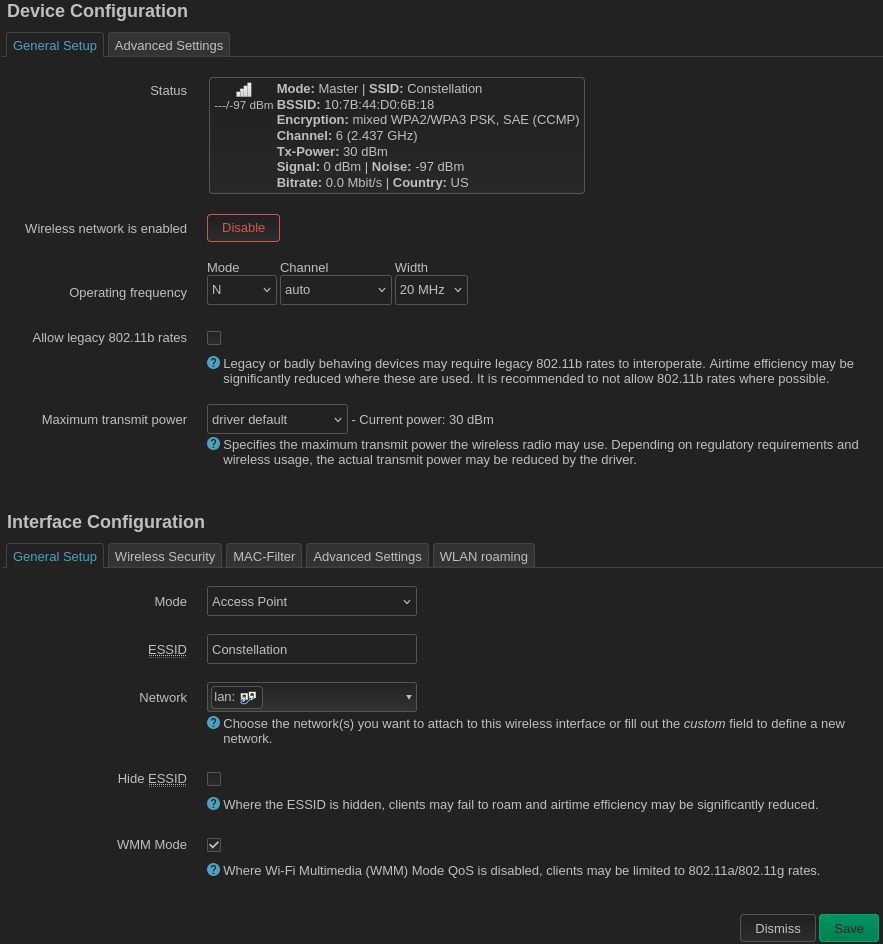
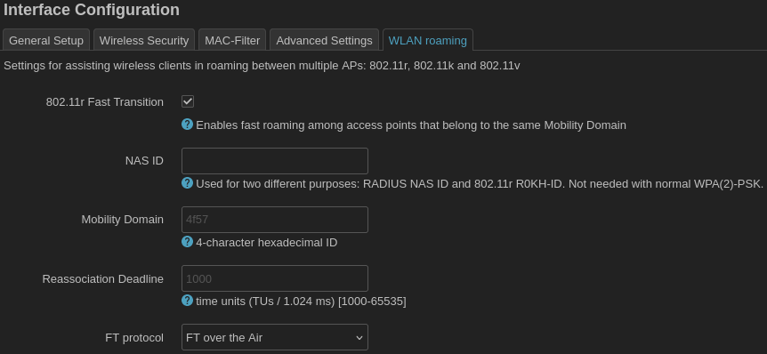

### Configuring the access points

Configure the non-mesh radios as access points as you usually would. You do not want the AP radio to be on the same channel as the mesh radio because they will interfere with each other. You also do not want different physical, neighboring access points to be on the same channel because they will interfere with each other. Set the `Channel` to `auto` to make each access point automatically select a different channel from its neighbors (and the mesh).

You will associate the access points with the `lan` network as usual. Since the `lan` network is bridged to `bat0`, traffic to/from the access points can be routed through `bat0`, `batmesh`, and the 802.11s radio.

You _should_ configure 802.11r fast transition on the access points to allow connected devices to more seamlessly transition between different AP's in the mesh. Go to the `WLAN roaming` tab and check the box `802.11r Fast Transition`. All access points with the same SSID should be given the same `Mobility Domain`. You can leave this as OpenWRT's default, `4f57`, or change it to any 4-character hexadecimal ID provided it is the same on all AP's. The `FT protocol` should be left as `FT over the Air`.

