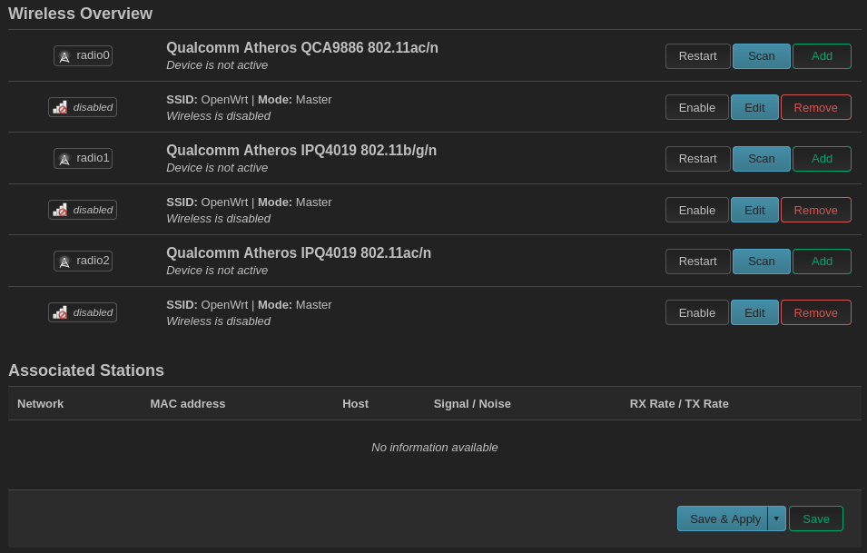
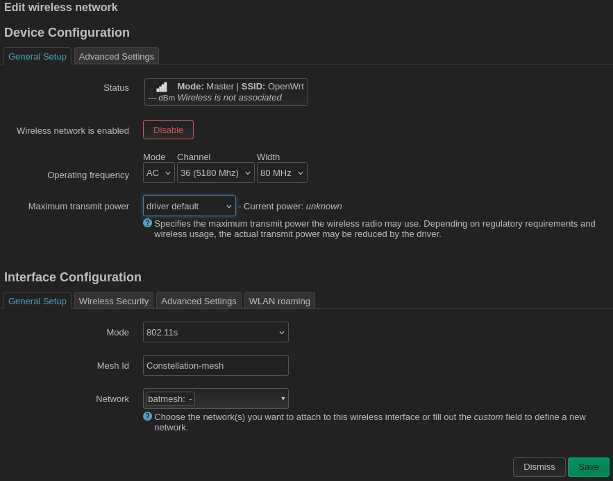
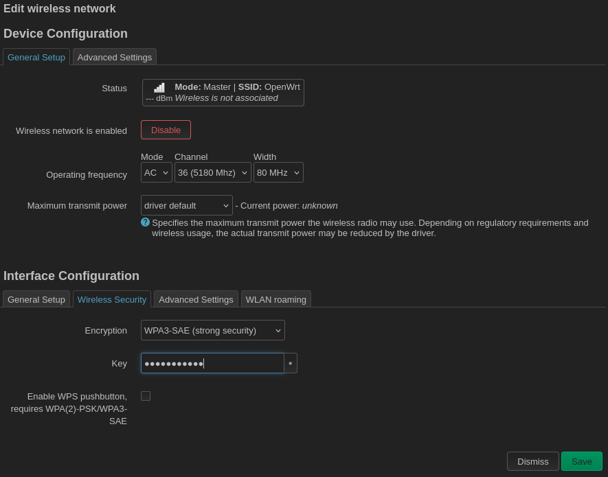
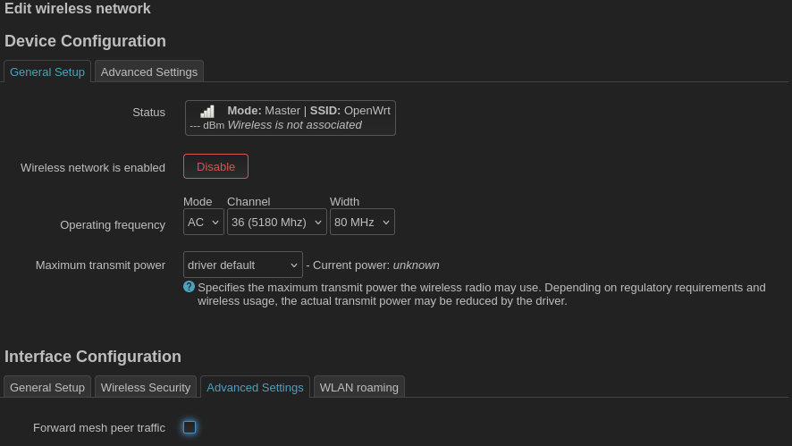

### Configurating a radio for mesh

Navigate to `Network > Wireless`.

In this example there are three radios, all of which have been configured in AP (access point) mode by default. There are two 5 GHz (802.11ac) radios. The first, `radio0`, is hardware-limited to transmit on the lower half of the 5 GHz band. The other, `radio2`, is hardware-limited to transmit on the upper half of the 5 GHz band. The upper half of the 5 GHz band can be unstable due to [DFS](https://en.wikipedia.org/wiki/Dynamic_frequency_selection), so we will use the more reliable `radio0` for our mesh backhaul. Click `Edit` on the wireless interface just below `radio0` (or click `Remove` on the interface and click `Add` next to `radio0` to make a new interface).

Use the dropdown menu to change the interface's `Mode` to `802.11s`. For the mesh id, chose a name that will be different from the name of the access point. In this example the access point will have the SSID `Constellation`, so for the mesh ID we will use the name `Constellation-mesh`. This ID must be the same on all mesh ndoes. For `Network` chose the `batmesh` interface created in the previous steps. Do _not_ set the wireless channel to auto. The wireless channel must be the same on all mesh nodes. Next go to the `Wireless Security` tab.

Choose a WPA3-SAE key. The key must be the same on all mesh nodes. The key does not have to be the same as the key used for the access point.

Under advanced settings, _un_-check the box for `Forward mesh peer traffic`. The 802.11s mesh forwards mesh peer traffic using the OLSR routing protocol by default. By un-checking this box, you disable OLSR allow peer traffic to be forwarded using the batman routing protocol instead.

Do _not_ configure wireless roaming on the mesh nodes. You _will_ configure wireless roaming on the access points.